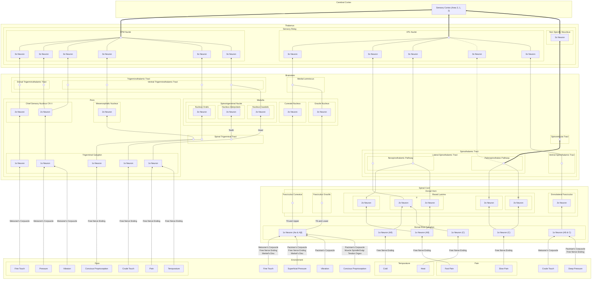

```mermaid
flowchart BT
  subgraph Cerebral Cortex
    sensoryCortex["Sensory Cortex (Area 3, 1, 2)"]
  end

  subgraph Thalamus
  direction BT
    subgraph Sensory Relay
      subgraph VPM Nuclei
        3oFineTouchFace["3o Neuron"] --- VPM((" ")) ==> sensoryCortex
        3oPressureVibrationFace1["3o Neuron"] --- VPM
        3oPressureVibrationFace2["3o Neuron"] --- VPM
        3ocProprioceptionFace["3o Neuron"] --- VPM
        3oCrudeTouchFace["3o Neuron"] --- VPM
        3oPainTempFace["3o Neuron"] --- VPM
      end
      subgraph VPL Nuclei
        3oFTouch["3o Neuron"] --- VPL((" ")) ==> sensoryCortex
        3oTemp["3o Neuron"] --- VPL
        3oFastPain["3o Neuron"] --- VPL
        3oSlowPain2["3o Neuron"] -.- VPL
        3oCTouch["3o Neuron"] --- VPL
      end
      subgraph Non Specific Neucleus
        3oSlowPain1["3o Neuron"] ==> sensoryCortex
      end
    end
  end

  subgraph Brainstem
    subgraph Pons
      subgraph Trigerminal Ganglion
        1oPainTempFace["1o Neuron"]
        1oPressureVibrationFace["1o Neuron"]
        1oFineTouchFace["1o Neuron"]
        1oCrudeTouchFace["1o Neuron"]
        1oCProprioceptionFace["1o Neuron"]
      end

      subgraph Chief Sensory Nucleus CN V
        2oFineTouchFace["2o Neuron"]
        2oPressureVibrationFace("2o Neuron")
      end

      subgraph Mesencephalic Nucleus
        2oCProprioceptionFace["2o Neuron"]
      end
    end

    subgraph Medulla
      subgraph Gracile Nucleus
        2oFTouchLo[2o Neuron]
      end

      subgraph Cuneate Nucleus
        2oFTouchUp[2o Neuron]
      end

      subgraph Spinotrigerminal Nuclei
        subgraph Nucleus Interpolaris
          2oPainTempFaceTeeth["2o Neuron"]
        end
        subgraph Nucleus Caudalis
          2oPainTempFaceHead["2o Neuron"]
        end
        subgraph Nucleus Oralis
          2oCrudeTouchFace["2o Neuron"]
        end
      end
    end

    subgraph Medial Lemniscus
      2to3FTouch((" "))
    end

    subgraph Spinoreticula Tract
      2to3SlowPain1((" "))
    end

    subgraph Spinothalamic Tract
      subgraph Lateral Spinothalamic Tract
        subgraph Neospinothalamic Pathway
          2to3Temp((" "))
          2to3FastPain((" "))
        end
        subgraph Paleospinothalaic Pathway
          2to3SlowPain2((" "))
        end
      end

      subgraph Ventral Spinothalamic Tract
        2to3CTouch((" "))
      end
    end

    subgraph Spinal Trigerminal Tract
      1to2PainTempFace((" "))
      1to2CrudeTouchFace((" "))
      1to2cProprioceptionFace((" "))
    end

    subgraph Trigerminothalamic Tract
      subgraph Dorsal Trigerminothalamic Tract
        2to3FineTouchFace((" "))
        2to3PressureVibrationFace1((" "))
      end

      subgraph Ventral Trigerminothalamic Tract
        2to3PressureVibrationFace2((" "))
        2to3PainTempFace((" "))
        2to3CrudeTouchFace((" "))
        2to3cProprioceptionFace((" "))
      end
    end
  end

  subgraph Spinal Cord
    subgraph Dorsal Horn
      subgraph Rexed Lamina
        subgraph II
          2oSlowPain1["2o Neuron"]
        end
        subgraph III
          2oSlowPain2["2o Neuron"]
        end
        subgraph V
          2oTemp["2o Neuron"]
          2oFastPain2["2o Neuron"]
        end
        subgraph I
          2oFastPain1["2o Neuron"]
        end
      end

      subgraph Dorsolateral Fasciculus
        2oCTouch["2o Neuron"]
      end

      subgraph Fasciculus Gracilis
        1to2FTouchLo((" "))
      end

      subgraph Fasciculus Cuneatus
        1to2FTouchUp((" "))
      end
    end

    subgraph Dorsal Root Ganglion
      1oFastPain["1o Neuron (Aδ)"]
      1oSlowPain["1o Neuron (C)"]

      1oHeat["1o Neuron (C)"]
      1oCold["1o Neuron (Aδ)"]

      1oCTouch["1o Neuron (Aδ & C)"]
      1oFTouch["1o Neuron (Aα & Aβ)"]
    end
  end

  subgraph Environment
    subgraph Face
      painFace["Pain"]
      tempFace["Tempurature"]
      cTouchFace["Crude Touch"]
      fTouchFace["Fine Touch"]
      cProprioceptionFace["Concious Proprioception"]
      pressureFace["Pressure"]
      vibrationFace["Vibraion"]
    end

    subgraph Pain
      fastPain[Fast Pain]
      slowPain[Slow Pain]
    end

    subgraph Tempurature
      heat[Heat]
      cold[Cold]
    end

    cTouch["Crude Touch"]
    fTouch["Fine Touch"]

    sPressure["Superficial Pressure"]
    dPressure["Deep Pressure"]

    vibration["Vibration"]

    cProprioception["Concious Proprioception"]
  end

  %% Face
  %% Pain Temp
  painFace & tempFace -- "Free Nerve Ending" ----> 1oPainTempFace --- 1to2PainTempFace

  1to2PainTempFace -- Teeth --> 2oPainTempFaceTeeth
  1to2PainTempFace -- Head --> 2oPainTempFaceHead

  2oPainTempFaceTeeth & 2oPainTempFaceHead --- 2to3PainTempFace --> 3oPainTempFace

  %% Crude Touch
  cTouchFace -- "Free Nerve Ending" --> 1oCrudeTouchFace --- 1to2CrudeTouchFace --> 2oCrudeTouchFace --- 2to3CrudeTouchFace --> 3oCrudeTouchFace

  %% Fine Touch
  fTouchFace -- "Meissner's Corpuscle" --> 1oFineTouchFace --> 2oFineTouchFace --- 2to3FineTouchFace --> 3oFineTouchFace

  %% Concious Proprioception
  cProprioceptionFace -- "Free Nerve Ending" --> 1oCProprioceptionFace --- 1to2cProprioceptionFace --> 2oCProprioceptionFace --- 2to3cProprioceptionFace --> 3ocProprioceptionFace

  %% Pressure & Vibraion
  pressureFace & vibrationFace -- "Meissner's Corpuscle" --> 1oPressureVibrationFace --> 2oPressureVibrationFace --- 2to3PressureVibrationFace1 & 2to3PressureVibrationFace2
  2to3PressureVibrationFace1 --> 3oPressureVibrationFace1
  2to3PressureVibrationFace2 --> 3oPressureVibrationFace2

  %% Non-Face
  %% Fast Pain
  fastPain -- "Free Nerve Ending" --> 1oFastPain --> 2oFastPain1 & 2oFastPain2 --- 2to3FastPain --> 3oFastPain
  
  %% Slow Pain
  slowPain -- "Free Nerve Ending" --> 1oSlowPain --> 2oSlowPain1 & 2oSlowPain2 --- 2to3SlowPain2
  2to3SlowPain2 -.-> 3oSlowPain2
  2to3SlowPain2 ==> 2to3SlowPain1 ==> 3oSlowPain1

  %% Temp
  cold -- "Free Nerve Ending" --> 1oCold --> 2oTemp --- 2to3Temp --> 3oTemp
  heat -- "Free Nerve Ending" --> 1oHeat --> 2oTemp

  %% Crude Touch
  cTouch -- "Meissner's Corpuscle" --> 1oCTouch --> 2oCTouch --- 2to3CTouch --> 3oCTouch
  dPressure -- "Pacinian's Corpuscle\nFree Nerve Ending" --> 1oCTouch

  %% Fine Touch
  fTouch -- "Meissner's Corpuscle\nFree Nerve Ending\nMerkel's Disc" --> 1oFTouch -- T6 and Lower --- 1to2FTouchLo --> 2oFTouchLo
  1oFTouch -- T6 and Upper --- 1to2FTouchUp --> 2oFTouchUp
  2oFTouchUp & 2oFTouchLo --- 2to3FTouch --> 3oFTouch

  sPressure -- "Pacinian's Corpuscle\nFree Nerve Ending\nMerkel's Disc" --> 1oFTouch
  vibration -- "Pacinian's Corpuscle" --> 1oFTouch
  cProprioception -- "Pacinian's Corpuscle\nMuscle Spindle\Golgi Tendon Organ" --> 1oFTouch
  
```